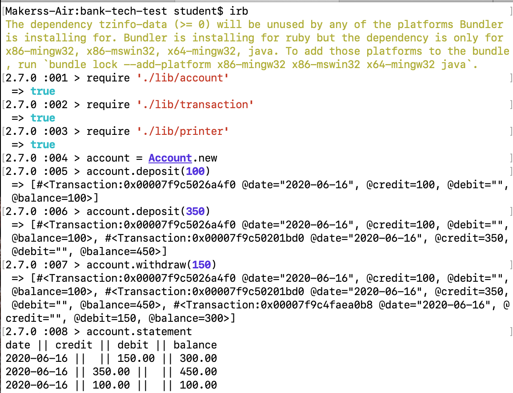

# Bank tech test

This is a small project to practice TDD and OO design.

## Specification

### Requirements

* You should be able to interact with your code via a REPL like IRB or the JavaScript console.  (You don't need to implement a command line interface that takes input from STDIN.)
* Deposits, withdrawal.
* Account statement (date, amount, balance) printing.
* Data can be kept in memory (it doesn't need to be stored to a database or anything).

### Acceptance criteria

**Given** a client makes a deposit of 1000 on 10-01-2012  
**And** a deposit of 2000 on 13-01-2012  
**And** a withdrawal of 500 on 14-01-2012  
**When** she prints her bank statement  
**Then** she would see

```
date || credit || debit || balance
14/01/2012 ||  || 500.00 || 2500.00
13/01/2012 || 2000.00 ||  || 3000.00
10/01/2012 || 1000.00 ||  || 1000.00
```

### Getting started

Clone this repository to your local machine.

```rb
# install dependencies
$ bundle install

# to run tests
$ rspec
```

To run the program in the irb

```rb
$ irb

> require './lib/account'
 => true
> require './lib/transaction'
 => true
> require './lib/printer'
 => true
```



## Approach

I started by writing the user stories and braking the task into smaller steps. I then started to identify what classes and methods I need to implement.

### User stories

```
As a user,
I want to be able to make a bank account.
```

```
As an account holder,
I want to be able to make a deposit.
```

```
As an account holder,
I want to be able to make a withdrawal.
```

```
As an account holder,
I want to see a warning when there are insufficient funds.
```

```
As an account holder,
I want to be able to print an account statement.
```

### Classes and methods

The program is split into three classes: Account, Transaction, Printer. Each class is handling a single responsibility.

#### Account

Account class ties everything together by delegating the functionality of the program to the other classes.

* `#deposit()` - delegates transaction creation to Transaction class
* `#withdraw()` - delegates transaction creation to Transaction class
* `#statement` - delegates statement printing to Printer class

#### Transaction

Transaction class is responsible for keeping track of all transactions that the account holder makes. It is using class methods to store and retrieve all the transactions.

* `.add_to_transactions()` - it uses a class variable to store Transaction instances
* `.transactions` - getter for `@@transactions`
* `.updated_balance()` - updates the balance of the account
* `sufficient_balance?()` - checks if there are sufficient funds to make a withdrawal

#### Printer

Printer class is responsible for statement creation. Works with Transaction class to format and print the statement.

* `#print_statement`
* `#print_header` - private method
